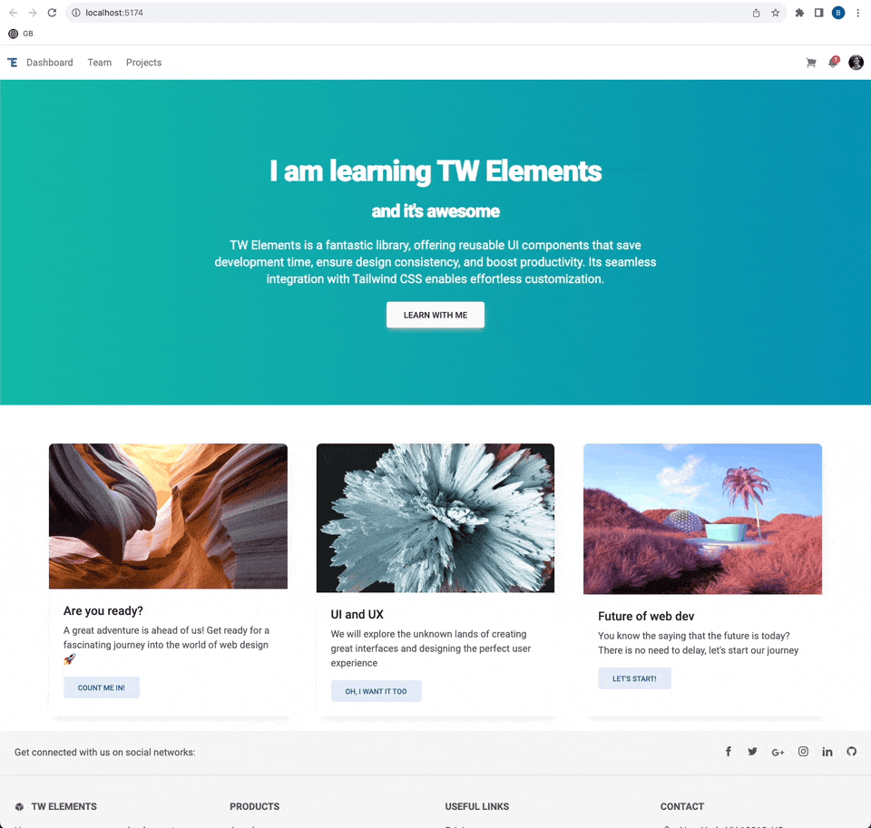

# Tutorials by MDB

- [te-quick-start](https://tw-elements.com/learn/te-foundations/basics/quick-start/)
- [te-vite](https://tw-elements.com/learn/te-foundations/basics/vite/)
- [tailwind-elements](https://tw-elements.com/learn/te-foundations/basics/create-website/)

## How to run completed projects?

Open folder with project (like `te-quick-start`) and use this command:

```bash
# depend on npm or yarn installed
yarn dev

# for tailwind-elements
npm start
```

## Example of `tailwind-elements`


